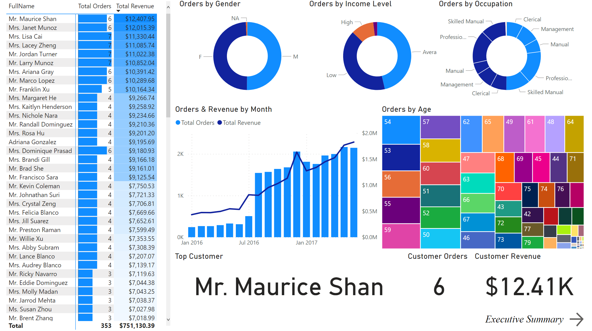

## Summary
In this project I reviewed Power BI functionality.  

Connected data from CSV Files, Folder, API, SQL server and Python script.  

With Power Query Editor transformed data using text, number, date, grouping, pivoting, unpivoting, merging and appending queries tools, created hierarchies, used query folding.  

Modeled data by normalizing, creating relationships (fact and dimension tables, star and snowflake schemas), used one-way filters and 1 to many relationships.  

Analyzed data with DAX by calculating columns and explicit measures. Used conditional and logical, date and time, text, math and stats, COUNT, CALCULATE, ALL, FILTER, iterator, RELATED, time intelligence functions.  

Visualized data with objects, charts, conditional formatting, tooltips, filtering, drill through filters, interactive visualizations, bookmarks, what-If parameters, WordCloud.  

All details can be found below and in [“My project.pbix” file], data [source].

[“My project.pbix” file]: <https://github.com/Geduifx/Power-BI/blob/main/My%20project.pbix>
[source]: <https://github.com/Geduifx/Power-BI/tree/main/Data%20source>

## Report and Model

 
 
 

 
 
 

 
 
 

 
 
 

## Connecting Data
I used Microsoft AdventureWorks sample CSV Files. Added files one by one, also as a Folder. 

Also connected [data from API]. New query > Web.  

[data from API]: <https://www.alphavantage.co/documentation/>

For direct query from SQL server used SQL Server Management Studio (SSMS), SQL Server 2019 Express to setup local SQL server. Used AdventureWorks sample databases backup to restore database. Used this database as a SQL source in Power BI.  

Also imported data from Python script.  

## Transforming Data with Power Query Editor
### Basic Table Transformations
Home > Remove Other Columns (Always same set of columns).  
Home > Keep / Remove Rows.  
Imported AdventureWorks_Products.csv.  
Power BI automatically promoted headers and changed data types.  
Renamed table to AW_Product_Lookup. It is a good practice to plan and use convenient naming in advance.  
Removed ProductSize column.  
Imported AdventureWorks_Customers.csv. Renamed to AW_Customer_Lookup.  
### Text tools
Transformed Prefix and Name columns. Format > Capitalize Each Word.  
Merged these columns in to new FullName column.  
Renamed Applied Step to a more precise “Inserted FullName Column”.  
From EmailAddress column extracted user names. Extract > Text Before Delimiter.  
Renamed new column to UserName.  
From EmailAddress column extracted domain. Extract > Text Between Delimiters.  
Renamed new column to Domain. Transform > Replace Values > “-“ to space. Capitalized each word.  
Modified AW_Product_Lookup query.  
Added a calculated column that extracts all characters before the second dash in the ProductSKU column, named "SKUType".  
Replace zeros in the ProductStyle column with "NA".  
### Number tools
Did some exploratory analysis, checked how many customers there are. CustomerKey column > Transform > Statistics > Count distinct values. Removed last step.  
Similarly checked average and max product prices, Transform > Statistics.  
Rounded Product Cost and Price to two decimal places. Transform > Rounding.  
Calculated discounted price. Add Column > Standard > Multiply 0.9. Renamed column, rounded.  
Updated the DiscountPrice calculation to 15%, by multiplying the ProductPrice values by 0.85 (Inserted Multiplication step > Eddit settings).  
Modified AW_Customer_Lookup query.  
Added a conditional column to categorize customer income (named "IncomeLevel"), based on the following criteria:  
If AnnualIncome >= $150,000, then IncomeLevel = "Very High"  
If AnnualIncome >= $100,000, then IncomeLevel = "High"  
If AnnualIncome >= $50,000, then IncomeLevel = "Average"  
Otherwise IncomeLevel = "Low"  
### Date tools
Imported AdventureWorks_Calendar.csv. Renamed to AW_Calendar_Lookup.  
Did some exploratory analysis. Transform > Date > Earliest and Latest.  
Add column > Date > Day > Name of day.  
Add column > Date > Week > Start of Week.  
Modified M code to start week from Monday. Date.StartOfWeek([Date],1), can replace 1 with Day.Monday.  
Add column > Date > Month > Start of Month.  
Similarly added Name of Month, Start of Year, Year.  
Modified dates table will help analize data sorted by weeks, months, years.  
Created a Rolling Calendar.  
Blank Query. M code Start date =#date(2018,1,1).  
M code = List.Dates (Source, Number.From(DateTime.LocalNow()) - Number.From(Source), #duration(1,0,0,0)).  
List Tools > To table. Changed data type to Date.  
Imported AdventureWorks_Sales_2017.csv. Renamed to AW_Sales_2017.  
Add Conditional Column > QuantityType.  
If OrderQuantity = 1, Single Item.  
Else If OrderQuantity > 1, Multiple Items.  
Else Other.  
Could also Add Index column and use as order ID. Select Index column > Right click > Move to beginning.  
Modified AW_Customer_Lookup query.  
Added a new calculated column for the year of birth (named "BirthYear"), based on BirthDate.  
### Grouping and Aggregating Records
Could summarize Sales table by grouping. Transform > Group By > Advanced > CustomerKey and PorductKey groups > Sum of OrderQuantity.  
### Pivoting & Unpivoting Data
Convert rows to columns or columns to rows. Pivoting can aggregate data.  
Imported Unpivot.csv. Used first row as headers.  
Selected first column > Transform > Unpivot other columns.  
Selected first column > Transform > Pivot column by value.  
Could achieve same result by Transform > Transpose. Use first row as headers.
### Merging Queries
Merging adds additional columns. Usually, good practice is to keep tables separate and define relationships between them.  
Often merging data creates redundant data and utilizes significantly more memory and processing power than creating relationships between multiple small tables.  
Home > Merge Queries > Select matching columns from two tables > Click button with two arrows on the right of new Merged Queries Column Header > Choose which columns to include in table.  
### Appending Queries
Merging adds columns, appending adds rows (with same columns).  
Imported AdventureWorks_Sales_2016.csv. Renamed. Same for 2015.  
Removed QuantityType column from AW_Sales_2017 query. So that all three sales tables have same column structure.  
Selected AW_Sales_2017 query > Home > Append queries as new > Three or more tables.  
Source sales queries can’t be deleted because they are referenced by new appended query. It this case it would be better to load all files that need appending from Folder.  
New Query > More > Folder > Transform data.  
Select Content column > Home > Combine Files.  
Deleted Source.Name column.  
Can place new file in folder, refresh Power Query and it  will be updated with data from new file.  
Home > Data source settings. Need to Change Source if file name or location changes.  
### Query Refresh Settings
Can select any query and in drop down menu deselect “Include in report refresh”.  
It is a good practice to exclude queries that don’t change often, like lookups or static data tables.  
Imported AdventureWorks_Product_Categories.csv and AdventureWorks_Product_Subcategories.csv. Renamed and disabled report refresh for both.  
### Additional Data Types and Categories
Power BI > Data > AW_Calendar_Lookup query > Select Date column > Format > Change to short date. Same for other date columns.  
AW_Product_Lookup query > ProductCost column > Format > Currency. Same for prices.  
Imported AdventureWorks_Territories.csv. Renamed.  
Power BI > Data > AW_Territories_Lookup query > Country column > Data category > Country. Same for Continent. Will help with map visualizations.  
### Defining Hierarchies
Hierarchies are groups of nested columns that reflect multiple levels of granularity (e.g. Country, State, City). Each hierarchy can be treated as a single item, allowing users to drill up or down.  
Power BI > Data > AW_Territories_Lookup query > Continent Field > Create hierarchy. Country, Region Fields > Add to hierarchy in correct order.  
### Query Folding
Query Folding - passing workload from Power BI to data source (e.g. relation database engine).  
Added New query > SQL server database > Named “SQL Query Folding”.  
Added few steps that achieve folding.  
Then added Index Column, this step prevented folding and Applied Steps, View Native Query option was no longer available for this and subsequent steps which were performed by Power BI, not SQL server.  
Solution would be to perform as many transformations that can achieve folding in succession and only then perform transformations that prevent folding. In this case switch last two applied steps with each other.  
Transformations that prevent folding: merging or appending queries based on different sources, adding custom columns with complex logic, adding index columns.  
## Data Modeling
Analyzing and defining all the different data that is collected and produced, as well as the relationships between those bits of data.  
### Database Normalization
Organizing the tables and columns in a relational database to eliminate redundant data, minimize errors and anomalies, simplify queries and structure the database for meaningful analysis.  
It is a good practice when in a normalized database, each table serves a distinct and specific purpose (product information, dates, transaction records, customer attributes, etc.).  
Usually long and narrow tables are better than short and wide.  
### Creating Relationships Between Data/Fact Tables and Lookup/Dimension Tables
Data tables contain numbers or values, typically at a granular level, with ID or “key” columns that can be used to create table relationships.  
Lookup tables provide descriptive, often text-based attributes about each dimension in a table.  
Primary keys uniquely identify each row of a table, and match the foreign keys in related data tables.  
Foreign keys contain multiple instances of each value, and are used to match the primary keys in related lookup tables.  
Power BI > Model > Drag and drop keys from Sales table to Lookup tables. Star schema.  
Inactive relationship between Sales StockDate (OrderDate active) and Calendar Date. Can be activated later.  
Drag and drop keys between Product, Category, Subcategory tables. Snowflake schema.  
Relationships can also be managed at Power BI > Model > Home > Manage relationships or by double clicking relationship line.  
Relationship Cardinality. Cardinality refers to the uniqueness of values in a column. All relationships in this model are one to many.  
### Connecting Multiple Data/Fact Tables
It is a good practice to never create direct relationships between data tables. Instead, connect them through shared lookups.  
Imported AdventureWorks_Returns.csv. Renamed.  
Connected it to Calendar, Territories and Product tables. No connections to Customers or Sales.  
### Filter Flow
Lookup tables are arranged above data tables in this model as a visual reminder that filters “flow” downstream.  
When a table is filtered, that filter context is passed along to all related “downstream” tables (from one to many). Filters cannot flow “upstream”.  
It is possible to setup two-way filters (Edit relationship > Cross filter direction > Both), but these may show not complete information. Two-way Returns and Territory OrderQuantity filter wouldn’t show Territory 2 and 3 for Sales, because these territories are not available in Returns, only in Sales. Generally it is not recommended to use two-way filters in a more complex models.  
Usually, it is a good practice to design models with one-way filters and 1 to many cardinality, unless more complex relationships are necessary.  
Also, it is a good practice to hide the foreign key columns in Model, data tables to force report users to filter using the primary keys in the lookup tables.  
Hid all 5 foreign keys in Sales table and 3 foreign keys in Returns table. Can also hide in Data section.  
### Model Tools
In Power BI > Model > Fields > Select multiple fields > Properties pane > Display folder, adds fields to single folder.  
It is possible to add additional tabs on the bottom. In new tab Drag table > Right click on it > Add related tables. Nice way to zoom to specific segment if model is very big.  
## Analyzing Data with DAX
DAX (Data Analysis Expressions) is Power BI formula language built specifically to work with relational data models.  
### Calculated Columns
Values are calculated based on information from each row of a table (has row context).  
Appends static values to each row in a table and stores them in the model (which increases file size).  
Recalculates on data source refresh or when changes are made to component columns.  
Primarily used as rows, columns, slicers or filters.  
Calculated columns “live” in tables.  
Added new QuantityType column. Power BI > Data > AW_Sales > New column.  
QuantityType = IF(AW_Sales[OrderQuantity]>1,"Multiple items", "Single item")  
It is a good practice, when possible, to create calculated columns at the source (in raw database) or within the Query Editor. This is more efficient than processing those calculations in the Data Model.  

### DAX Measures
Values are calculated based on information from any filters in the report (has filter context).  
Does not create new data in the tables themselves (doesn’t increase file size).  
Recalculate in response to any change to filters within the report.  
Good practice is to use measures when a single row can’t give the answer (when aggregation is needed). Measures are used to create numerical, calculated values that can be analyzed in the “values” field of a report visual.  
Measures “live” in visuals.  
### Implicit and Explicit DAX Measures
Implicit measures are created when one drags raw numerical fields (like OrderQuantity) into the values pane of a visual and manually selects the aggregation mode (Sum, Average, Min/Max, etc).  
Implicit measures are only accessible within the specific visualization in which it was created, and cannot be referenced elsewhere.  
Explicit measures are created by actually entering DAX functions (or adding “quick measures”) to define calculated columns or measures.  
Explicit measures can be used anywhere in the report, and referenced within other DAX calculations to create “measure trees”.  
Added new explicit DAX measure. Power BI > Report > AW_Sales field > New measure.  
Quantity Sold = SUM(AW_Sales[OrderQuantity])  
It is a good practice to use explicit measures most of the time.  
Explicit measure location can be changed by selecting it > Home table.  
### Filter Context
All measures are evaluated based on filter context, which means that they recalculate whenever the fields or filters around them change.  
Because of different filter context Total in Matrix can differ from actual Total of Matrix rows (Orders column, two orders, Total = 2. Products rows, two products in each order, rows by products 2 + 2 = 4).  
When report user drills down, more filters are applied to measures.  
### DAX Syntax and Operators
It is a good practice to use the fully qualified name (Table[Column]) for column references and just the measure name ([Measure]) for measure references.  
Text/Logical Operators.  
& - concatenates two values to produce one text string.  
&& - creates an AND condition between two logical expressions.  
||  – creates an OR condition between two logical expressions.  
IN – creates a logical OR condition based on a given list (using curly brackets).  
### Date and Time Functions
Power BI > Data > AW_Calendar_Lookup > New column.  
Day of Week = WEEKDAY(AW_Calendar_Lookup[Date],2)  
AW_Customer_Lookup > New column.  
BirthYear_CC = YEAR(AW_Customer_Lookup[BirthDate]) or  
BirthYear_CC = AW_Customer_Lookup[BirthDate].[Year]  
Removed BirthYear column in Data section. Table was automatically updated in Power Query also.  
AW_Customer_Lookup > New column.  
Current Age = DATEDIFF(AW_Customer_Lookup[BirthDate],TODAY(),YEAR)  

### Conditional and Logical Functions (IFANDOR)
Power BI > Data > AW_Customer_Lookup > New column.  
Parent = IF(AW_Customer_Lookup[TotalChildren]>0,"Yes","No")  
Power BI > Data > AW_Calendar_Lookup > New column.  
Weekend = IF(OR(AW_Calendar_Lookup[Day of Week]=6,AW_Calendar_Lookup[Day of Week]=7),"Weekend","Weekday")  
A more readable option with || instead of OR. || also lets to compare more than two arguments.  
Weekend = IF(AW_Calendar_Lookup[Day of Week]=6 || AW_Calendar_Lookup[Day of Week]=7,"Weekend","Weekday")  

### Text Functions
Power BI > Data > AW_Customer_Lookup > New column.  
Used & Instead of CONCATENATE, which is limited to two strings.  
FullName_CC = AW_Customer_Lookup[Prefix] & " " & AW_Customer_Lookup[FirstName] & " " & AW_Customer_Lookup[LastName]  
Power BI > Data > AW_Calendar_Lookup > New column.  
Short Month = UPPER(LEFT(AW_Calendar_Lookup[Month Name],3))  

### Joining Data with RELATED
It is a good practice to avoid using RELATED to create redundant calculated columns unless they are absolutely need. Instead, it is better to use RELATED within a measure like FILTER or SUMX.  
Power BI > Data > AW_Sales > New column.  
RetailPrice = RELATED(AW_Product_Lookup[ProductPrice])  
Revenue = AW_Sales[RetailPrice] * AW_Sales[OrderQuantity]  
In order to design a “slimmer” model it might be a good idea to use DAX iterator function (SUMX) with RELATED instead of Revenue and RetailPrice columns.  
### Basic Math and Stats Functions
Power BI > Report > AW_Returns > New measure.  
Quantity Returned = SUM(AW_Returns[ReturnQuantity])  
Power BI > Report > AW_Sales > New measure.  
Total Revenue = SUM(AW_Sales[Revenue])  
Formatted Total Revenue measure as Currency.  
Power BI > Report > AW_Returns > New measure.  
Return Rate = DIVIDE([Quantity Returned],[Quantity Sold],"No Sales")  
Formatted as Percentage.  
Power BI > Report > AW_Product_Lookup > New measure.  
Avg Retail Price = AVERAGE(AW_Product_Lookup[ProductPrice])  

### COUNT Functions
Power BI > Report > AW_Returns > New measure.  
Total Returns = COUNTROWS(AW_Returns)  
Power BI > Report > AW_Sales > New measure.  
Total Orders = DISTINCTCOUNT(AW_Sales[OrderNumber])  

### CALCULATE Function
CALCULATE works just like SUMIF or COUNTIF in Excel, except it can evaluate measures based on ANY sort of calculation (not just a sum, count, etc).  
CALCULATE modifies and OVERRULES any competing filter context.  
Power BI > Report > AW_Sales > New measure.  
Bulk Order = CALCULATE([Total Orders],AW_Sales[OrderQuantity] > 1)  
Weekend Orders = CALCULATE([Total Orders],AW_Calendar_Lookup[Weekend] = "Weekend")  

### CALCULATE and ALL
Instead of adding filter context, ALL removes it. This is often used when one needs unfiltered values that won’t react to changes in filter context (% of Total, where the denominator needs to remain fixed).  
Power BI > Report > AW_Sales > New measure.  
ALL orders = CALCULATE([Total Orders],ALL(AW_Sales))  
% of All orders = [Total Orders] / [ALL orders]  

Power BI > Report > AW_Product_Lookup > New measure.  
Overall Avg Price = CALCULATE([Avg Retail Price],ALL(AW_Product_Lookup))  

### CALCULATE and FILTER
FILTER returns a table that represents a subset of another table or expression.  
FILTER is used to add new filter context, and can handle more complex filter expressions than CALCULATE (by referencing measures, for example).  
Since FILTER returns an entire table, it’s almost always used as an input to other function, like CALCULATE or SUMX.  
Since FILTER iterates through each row in a table, it can be slow and processor intensive. It is a good practice to use CALCULATE instead of FILTER if same result can be accomplished.  
Power BI > Report > AW_Sales > New measure.  
High Ticket Orders = CALCULATE([Total Orders], FILTER(AW_Product_Lookup,AW_Product_Lookup[ProductPrice] > [Overall Avg Price]))  

### Iterator Functions
Iterator (or X) functions allow to loop through the same calculation or expression on each row of a table, and then apply some sort of aggregation to the results (SUM , MAX , etc).  
Imagine the function adding a temporary new column to the table, calculating the value in each row (based on the expression) and then applying the aggregation to that new column.  
Power BI > Report > AW_Sales > New measure.  
Total Revenue SUMX = SUMX(AW_Sales,AW_Sales[OrderQuantity] * RELATED(AW_Product_Lookup[ProductPrice]))  
Now Total Revenue SUMX can be used instead of Total Revenue measure, so RetailPrice and Revenue columns can be removed from AW_Sales table.  
If reporting is running slow, used iterator functions should be one of the first things to check, as these functions demand processing power.  

### Time Intelligence Functions
Time Intelligence functions allow to easily calculate common time comparisons.  
Power BI > Report > AW_Sales > New measure.  
YTD Revenue = CALCULATE([Total Revenue SUMX], DATESYTD(AW_Calendar_Lookup[Date]))  
Prev Month Revenue = CALCULATE([Total Revenue SUMX], DATEADD(AW_Calendar_Lookup[Date],-1,MONTH))  
Revenue Target = [Prev Month Revenue] * 1.1  
10-day Rolling Revenue = CALCULATE([Total Revenue SUMX], DATESINPERIOD(AW_Calendar_Lookup[Date], MAX(AW_Calendar_Lookup[Date]), -10, DAY))  

### Additional calculated columns and measures
Power BI > Data > AW_Customer_Lookup > New column.  
Customer Priority = IF(AW_Customer_Lookup[Current Age]<50 && AW_Customer_Lookup[AnnualIncome]>100000,"Priority","Standard")  
Power BI > Data > AW_Product_Lookup > New column.  
Price Point = IF(AW_Product_Lookup[ProductPrice]>500,"High",IF(AW_Product_Lookup[ProductPrice]<100,"Low","Mid-Range"))  
SKU Category = LEFT(AW_Product_Lookup[ProductSKU],FIND("-",AW_Product_Lookup[ProductSKU])-1)  

Power BI > Data > AW_Calendar_Lookup > New column.  
Short Day = UPPER(LEFT(AW_Calendar_Lookup[Day Name],3))  

Power BI > Report > New measures.  
Product Models = DISTINCTCOUNT(AW_Product_Lookup[ModelName])  
ALL Returns = CALCULATE(AW_Returns[Total Returns],ALL(AW_Returns))  
% of All Returns = [Total Returns] / [ALL Returns]  
Bike Returns = CALCULATE([Total Returns], AW_Product_Category_Lookup[CategoryName]="Bikes")  
Total Cost = SUMX(AW_Sales,AW_Sales[OrderQuantity] * RELATED(AW_Product_Lookup[ProductCost]))  

Total Profit = [Total Revenue SUMX] - [Total Cost]  
Prev Month Orders = CALCULATE([Total Orders], DATEADD(AW_Calendar_Lookup[Date],-1,MONTH))  
Order Target = [Prev Month Orders] * 1.1  
Prev Month Returns = CALCULATE([Total Returns], DATEADD(AW_Calendar_Lookup[Date],-1,MONTH))  
90-day Rolling Profit = CALCULATE([Total Profit],DATESINPERIOD(AW_Calendar_Lookup[Date],MAX(AW_Calendar_Lookup[Date]),-90,DAY))  

## Visualizing Data
### Simple Objects
Inserted Adventure Works logo picture. Power BI > Report > Insert > Image.  
Power BI > Report > View > Grid and lock options are useful for arranging visuals.  
Renamed first Report Tab to Exec Summary.  
### Basic Charts and Visuals
Inserted Stacked Bar chart.  
Added Total orders measure and broke it down by Product Subcategory.  
Highlighted categories which bring most of revenue. Visualizations > Format your visual > Bars > Conditional formatting > Based on Total Revenue SUMX measure.  
Added Total Revenue SUMX and Total profit to the information that is displayed when mouse is hovered over the bar. Visualizations > Add data to your visual > Tooltips.  
Reports can be filtered at single visual, page or all pages level.  
### Matrix
Inserted Matrix. Added Total Orders and Return rate measures to Values.  
Segmented them by Product Name. Sorted by Total Orders.  
Used conditional formatting, data bars for Total orders and background for Return rates.  
Added category and subcategory to rows, so report user can drill down category > subcategory > product.  
### Date Slicers
Added slicer with between Date.  
By using slicer, it is clear that at the start only bikes were sold and only two subcategories of them.  
Later in 2016 Adventure Works started selling accessories and clothing.  
Since business was quite different for last two years it might make sense to apply year 2016 and 2017 filter for all pages.  
Select slicer > View > Sync Slicers allows to sync slices between different report pages.  
### Cards and KPIs
Inserted KPI with Total revenue by Month and Prev Month Revenue as target.  
Inserted KPI with Total orders by Month and Prev Month Orders as target.  
Inserted KPI with Total orders by Month and Prev Month Orders as target. Formatted direction, low is good.  
### Text Cards
Inserted Card with Product name. Added Product Name to Filters Data fields. Show Top 1, by Total Orders.  
Inserted second similar card, filtered by Total profit.  
Can use CTRL to select multiple visual and Format > Align.  
### Maps
Inserted Map with Country and Total Orders. Total Revenue and Profit tooltips.  
Inserted Slicer with Continents. Orientation > Horizontal. Selection > Show All.  
### Treemaps
Replaced Total Order by Category Stacked bar chart with Treemap.  
### Line Charts
Created new page Product detail.  
Inserted Line chart with Total profit. Also added Total revenue and orders to Tooltips.  
Added Trend line and Forecast. Visualizations > Add further analysis to your visuals.  
Inserted Line chart with Total returns.  
### Gauge Charts
Added Gauge chart with Total orders.  
Based on last month. Filters > Start of Month to Data Field > Filter Type > Top 1, based on Start of Month > latest.  
Maximum Value (Could also use Target value) > Order target measure.  
Added similar Gauges for Revenue and Returns.  
### Report Interactions
By default, all visuals interact with each other, but this can be changed in Format > Edit interactions.  
Updated Slicer in Exec Summary page so that it doesn’t interact with KPIs. KPIs will always show current month data despite the changes in Slicer.  
Left Category Treemap relation with Subcategory Stacked bar chart set to Highlight (can be changed to Filter).  
### Drill through Filters
Added Product Name Card to Product detail page. Drill-through fields > Product name.  
Now in Exec Summary page it is possible to click on any product and choose Drill through > Product detail and Product detail page will open with all visuals filtered by specific product, also with back button in upper left.  
Drill through Filter is a great tool for Self-service BI.  
### Bookmarks
Product detail page > View > Bookmarks > Add “Product detail”.  
Exec Summary page > Insert > Text box “View Product detail”.  
Exec Summary page > Insert > Buttons > Information. Format > Actions > Type > Bookmark.  
### Testing Scenarios with What-If Parameters
Product detail page > Modeling > New parameter > Name “Price adjustment (%)” > Decimal number > From -1 to 1 > Increments 0.1 > Default 0. This also automatically creates new Price adjustment table.  
Created new measure Adjusted Price with calculation from new table.  
Adjusted Price = [Avg Retail Price] * (1+'Price adjustment (%)'[Price adjustment (%) Value])  
Tested Price adjustment slider with multi-row card (Adjusted price, Avg Retail price).  
Created new Adjusted Revenue calculation based on Total Revenue SUMX calculation.  
Adjusted Revenue = SUMX(AW_Sales,AW_Sales[OrderQuantity] * [Adjusted Price])  
Adjusted profit = [Adjusted Revenue] - [Total Cost]  
Made a copy of Total profit chart and added Adjusted profit to it.  
### Managing Roles and Row Level Security
Exec Summary page > Modeling > Manage roles > Create > Europe > AW_Territories_Lookup > [continent] = "Europe" > Save.  
Tested with Exec Summary page > Modeling > View as.   
### Report questions
Before creating report should answer following questions:  
What type of data are you visualizing? (Integer, categorical, time series, geo spatial, etc.)  
What are you trying to communicate? (Relationships, compositions, trending, etc.)  
Who is the end user consuming this information? (Analyst, CEO, client, intern, etc.)  
### “Customer Detail” page
Added a new report page “Customer Detail”.  
Added a matrix visual to show Total Orders and Total Revenue by customer full name for the top 100 customers by revenue.  
Sorted the matrix by Total Revenue (descending) to show the top revenue-generating customers.  
Added conditional formatting to show data bars on the Total Orders column and a background color scale on the Total Revenue column.  
Added a Donut Chart to show Total Orders by Gender. Changed title to “Orders by Gender”.  
Copied “Orders by Gender” chart and used it to create orders by IncomeLevel and Occupation Donut charts.  
Updated the report interactions so that each donut chart (as well as the matrix) filters the other two donuts, instead of highlighting.  
Added a Line & Clustered Column chart to show Total Orders (as columns) and Total Revenue (as a line), with Start of Month on the shared X-axis.  
Added a Treemap visual to show Total Orders (values) grouped by Current Age.  
Update the matrix interaction mode to filter the Line & Clustered Column chart and Treemap (vs. highlighting).  
Added a card to show #1 customer based on Total Revenue (Top N visual-level filter) and formatted it.  
Based on this card created cards for Total Orders and Revenue.  
Added a “Executive Summary” text box and inserted an arrow button next to it.  
Added a bookmark to Exec Summary page and linked it with button.  
### AI Visuals
Created new Q&A page with Q&A visual.  
Wrote a question “revenue by category”, then replaced key words with suggestions: revenue with total revenue and category with category name.  
Second question “total revenue for red bikes”. $1.01M, checked answer with Card.  
In Q&A options it is possible to review questions and teach Q&A.  
Also, Q&A answer can be turned in to standard visual and updated.  
Added page with Decomposition tree.  
### WordCloud
Power Query > New Query > Keywords from [Scraped data].

[Scraped data]: <https://github.com/Geduifx/Data-Scraping-with-Python>
Removed values: [ ] '.  
Split column by comma.  
Unpivoted columns.  
Formatted text to lower case and trimmed.  
Removed blanks and got 5767 KeyWords.  
Power BI > Report > Get more visuals > WordCloud. Inserted WordCloud with KeyWords and Count of Words.  
Turned of Word-breaking and turned on “Special characters”.  
## Credits
This project is based on Udemy course: [Microsoft Power BI Desktop for Business Intelligence].

[Microsoft Power BI Desktop for Business Intelligence]: <https://www.udemy.com/course/microsoft-power-bi-up-running-with-power-bi-desktop/>
